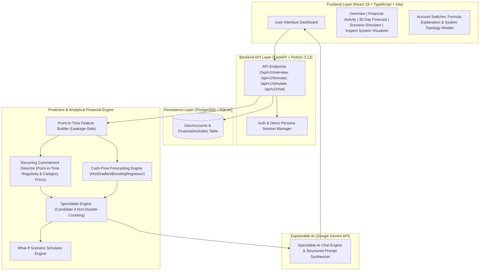

# SPENDABLE 💡

> **"Know what you can safely spend."**

🏆 **Hackathon Track**: **Track 03: Customer Innovation & Financial Independence**

Spendable is an AI-powered personal financial runway and liquidity intelligence platform. 

While traditional banking apps and spreadsheets display a static balance (e.g., *"You have ৳18,400"*), **Spendable** calculates and predicts how much of that balance is realistically and safely spendable after accounting for expected short-term outflows, detected recurring commitments, behavioral spending patterns, and dynamic safety reserves.

---

## 📐 System Architecture

Spendable enforces a strict separation between **Deterministic Financial Computation** and **Generative LLM Explanation**. Financial calculations, feature extraction, and ML predictions are computed purely in Python/C++ code; Google Gemini is invoked exclusively to synthesize natural-language explanations from structured engine outputs with strict financial guardrails.



---

## ⚡ Key Features & Application Tabs

Spendable features 5 core application tabs accessible from the top navigation bar:

1. **Overview Tab (Real-Time Spendable Liquidity Dashboard)**:
   - Displays your **Safe Spendable Capacity today** (e.g., *"৳22,552.76 Safely Spendable out of ৳59,835.05 balance"*).
   - Real-time progress indicators, protected safety buffer metrics, and upcoming 30-day bill timeline.

2. **Activity Tab (Multi-Channel Financial Ingestion)**:
   - Ingests and categorizes transaction activity across multi-channel bank and mobile wallet accounts.
   - Standardizes timestamps to ISO 8601 UTC strings and classifies direction (`INFLOW` vs `OUTFLOW`).

3. **Forecast Tab (30-Day Projected Cash Flow Runway)**:
   - Predicts 30-day daily balance trajectories using **HistGradientBoostingRegressor** models.
   - Evaluates recurring commitments via point-in-time regularity scoring and highlights low-liquidity crunch dates.

4. **Simulate Tab (What-If Scenario Engine & Spendable AI)**:
   - Evaluates 5 hypothetical scenarios in real-time (`ONE_TIME_EXPENSE`, `ADDITIONAL_INCOME`, `ADDITIONAL_COMMITMENT`, `SPENDING_REDUCTION`, `INCOME_DELAY`) without mutating underlying database tables.
   - Renders a **Multi-Metric Scenario Impact Dashboard** (Spendable Shift, Account Balance Shift, 30-Day Minimum Runway Shift, Protected Buffer).
   - Houses **Spendable AI**, a context-grounded conversational assistant powered by Google Gemini with strict financial scope guardrails.

5. **Inspect ⚡ System Visualizer Tab (Hackathon Video Demo & Architecture Walkthrough)**:
   - A 100% client-side visualizer built for hackathon recording and technical demonstration (consumes **0 Gemini API credits**).
   - Features a sequential **5-stage architecture flow** (`STAGE 01 Ingestion ➔ STAGE 02 Feature Store ➔ STAGE 03 ML Engine ➔ STAGE 04 Deterministic Math ➔ STAGE 05 Spendable AI`).
   - Deep-dive cards detailing training methods, hyperparameters, and responsible AI code-enforced boundaries.

---

## 📊 Machine Learning & Model Evaluation Breakdown

All evaluation metrics are computed on a **held-out synthetic test dataset** of **500 diverse financial personas** comprising **98,886 second-precision timezone-aware transactions**.

### Model Performance Summary (Held-Out Test Set)

| Module | Evaluated Metric | Test Result | Technical Definition |
| :--- | :--- | :---: | :--- |
| **Recurring Commitment Detection (Point-in-Time Detector)** | F1-Score | **97.99%** | $F_1$ harmonic mean across commitment categories |
| | Precision | **98.32%** | 293 TP / (293 TP + 5 FP) on held-out test data |
| | Recall | **97.67%** | 293 TP / (293 TP + 7 FN) on held-out test data |
| **Cash-Flow Forecasting (HistGradientBoostingRegressor)** | R² (30-Day Horizon) | **0.9948** | 99.48% of variance in 30-day balance trajectories explained |
| | MAE (30-Day Horizon) | **৳14,682** | Mean Absolute Error across evaluation snapshots |
| | RMSE (30-Day Horizon) | **৳23,903** | Root Mean Squared Error across evaluation snapshots |
| **Liquidity-Pressure Horizon Classifier** | Precision | **91.53%** | Accuracy of low-cash risk warnings |
| | Recall | **82.44%** | True positive risk detection rate |
| | F1-Score | **86.75%** | Overall risk classification harmonic mean |
| | Tight Liquidity F1-Score | **95.45%** | Specialized risk detection F1 on high-vulnerability personas |
| **Spendable Engine** | Safety Validation Check | **100.00%** | Non-double-counting commitment protection pass rate |
| **Scenario Simulation** | Sanity-Check Pass Rate | **100% (700/700)** | Zero violations across monotonicity & non-negative checks |

---

## 🧠 Technical Component Architecture

### 1. Point-in-Time Feature Builder (`FeatureBuilder`)
- Guarantees **STRICT ZERO LEAKAGE**: at snapshot timestamp $T$, features are computed exclusively from transactions with timestamps $t \le T$.
- Computes **40+ temporal and behavioral features**, including rolling liquidity windows (7d, 14d, 30d), inflow/outflow volatility ($\sigma_{\text{outflow}}$), Herfindahl-Hirschman category concentration index, and time-of-day indicators.

### 2. Recurring Commitment Detector (Point-in-Time Regularity & Category Priors)
- Evaluates multi-factor evidence matrices: interval regularity coefficient of variation ($CV_{\Delta t}$), amount consistency ($CV_{\text{amount}}$), observation recency, frequency count, and category priors (`CORE_COMMITMENT_CATEGORIES` vs `DISCRETIONARY_CATEGORIES`).
- Automatically groups recurring commitments (Housing/Rent, Utilities, Subscriptions, Debt EMI) and income streams into `STRONG` and `MODERATE` confidence categories without relying on future transaction data.

### 3. Cash-Flow & Minimum Balance Forecasting Engine (HistGradientBoostingRegressor)
- Trains a multi-horizon ensemble of **Histogram-Based Gradient Boosted Decision Trees** (`sklearn.ensemble.HistGradientBoostingRegressor`) on 38 point-in-time snapshot vectors to forecast 30-day trajectory paths and minimum balance drawdown $B_{\text{min, 30d}}$.
- Achieves **$R^2 = 0.9948$** and **$F_1 = 95.45\%$** on high-pressure personas.

### 4. Spendable Engine (Authoritative Formulation & Risk Modeling)
- Enforces non-double-counting protected balance:
$$\text{Spendable} = \max\left(0, \text{Balance} - \max(\text{Safety Reserve}, \text{Commitments})\right)$$
- Eliminates double-counting between expected recurring outflows and safety buffers, protecting user liquidity without artificial over-restriction.

### 5. What-If Scenario Simulation Engine
- Evaluates 5 hypothetical scenarios (`ONE_TIME_EXPENSE`, `ADDITIONAL_INCOME`, `ADDITIONAL_COMMITMENT`, `SPENDING_REDUCTION`, `INCOME_DELAY`) in memory.
- Passed **100% of 700 validation scenarios** across mathematical monotonicity laws, non-negative spendable constraints, and zero state mutation guarantees.

### 6. Spendable AI & Responsible AI Guardrails
- **100% Code-Enforced Financial Calculations**: All numbers, Spendable balances, and scenario deltas are computed in pure Python code.
- **Context Injection**: Pre-computed financial facts are passed to Gemini LLM to synthesize plain-language explanations with zero LLM arithmetic execution.

---

## 🛠️ Technology Stack

| Layer | Technologies |
| :--- | :--- |
| **Frontend** | React 19, TypeScript, Vite, Vanilla CSS (Dark Glassmorphism System), Lucide Icons |
| **Backend API** | Python 3.12+, FastAPI, Pydantic v2, SQLAlchemy ORM, Alembic Migrations |
| **Database** | PostgreSQL / SQLite (via SQLAlchemy & `psycopg2-binary`) |
| **ML & Analytics** | **HistGradientBoostingRegressor (`scikit-learn`)**, **Point-in-Time Recurring Detector**, `numpy`, `pandas`, `scipy` |
| **AI / LLM Integration** | Google Gemini API (`google-genai` Python SDK) |
| **Testing Suite** | `pytest` (118 passed test suites), `httpx`, `FastAPI TestClient` |
| **Container & Cloud** | Multi-stage Dockerfiles, Docker Compose, Railway Ready |

---

## 📁 Repository Structure

```
Spendable/
├── Dockerfile                  # Container configuration for Railway deployment
├── docker-compose.yml          # Local multi-container development environment
├── package.json                # Monorepo root developer scripts & process runner
├── pnpm-workspace.yaml         # pnpm workspace definition
├── README.md                   # Project documentation
├── backend/
│   ├── app/
│   │   ├── main.py             # FastAPI entry point & static SPA file server
│   │   ├── config.py           # Pydantic environment configuration
│   │   ├── database.py         # SQLAlchemy connection management
│   │   ├── api/                # Product API endpoints (/overview, /forecast, /simulate, /chat)
│   │   ├── features/           # Point-in-time leakage-safe feature builder
│   │   ├── recurring/          # Point-in-time recurring commitment detector & evaluator
│   │   ├── forecasting/        # HistGradientBoosting cash-flow forecasting models
│   │   ├── engine/             # Spendable Engine calculation formulations
│   │   ├── scenario/           # What-if scenario simulation engine
│   │   └── explanation/        # Spendable AI Gemini chat & explanation provider
│   └── tests/                  # 118 unit & integration test suites
└── frontend/
    ├── src/
    │   ├── pages/              # Overview, Financial Activity, Forecast, Simulate, Inspect pages
    │   ├── components/         # Header, LoginModal, ConfirmModal, CalculationModal
    │   ├── context/            # AuthContext & demo persona manager
    │   ├── api/                # Strictly-typed API client & endpoints
    │   └── utils/              # Date & Time, BDT Currency, and Status formatters
    └── vite.config.ts          # Vite React build configuration
```

---

## ⚡ Quickstart (`pnpm run dev`)

Launch the **entire application** (PostgreSQL container, FastAPI backend, and React Vite frontend concurrently):

```bash
pnpm run dev
```

This single command automatically:
1. Starts the PostgreSQL container via Docker Compose (`docker compose up -d postgres`).
2. Activates the Python virtual environment (`venv`) and starts the FastAPI backend server.
3. Launches the Vite React frontend with Hot Module Replacement (HMR).

---

## 🧪 Running Verification Suites

Backend unit tests are run via `pytest` using the project virtual environment:

```bash
$env:PYTHONPATH='backend'; python -m pytest backend/tests
```

Frontend production build and type checking:

```bash
pnpm --prefix frontend build
```

---

## 🚀 Deployment (Railway Monorepo)

The repository includes a containerized multi-stage [`Dockerfile`](Dockerfile) designed for **zero-fail single-instance deployment** on Railway:
1. **Stage 1 (Frontend Build)**: Builds static SPA assets using Node 22 and `pnpm`.
2. **Stage 2 (Python Runtime)**: Installs Python 3.12 requirements, copies compiled frontend static files to `/app/frontend/dist`, runs database migrations, and serves both FastAPI API endpoints and static SPA routing on `${PORT:-8000}`.
