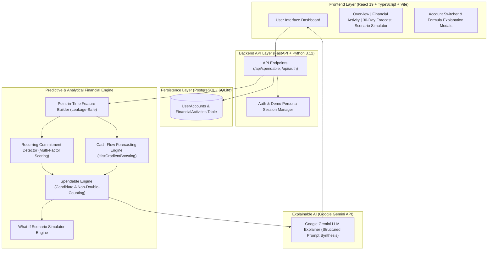

# SPENDABLE 💡

> **"Know what you can safely spend."**

Spendable is an AI-powered personal financial runway and liquidity intelligence platform. 

While traditional banking apps and spreadsheets display a static balance (e.g., *"You have ৳18,400"*), **Spendable** calculates and predicts how much of that balance is realistically and safely spendable after accounting for expected short-term outflows, detected recurring commitments, behavioral spending patterns, and dynamic safety reserves.

---

## ⚡ Quickstart (`pnpm run dev`)

Launch the **entire application** (PostgreSQL container, FastAPI backend, and React Vite frontend concurrently):

```bash
pnpm run dev
```

This single command automatically:
1. Starts the PostgreSQL container via Docker Compose (`docker compose up -d postgres`).
2. Activates the Python virtual environment (`venv`) and starts the FastAPI backend server.
3. Launches the Vite React frontend with Hot Module Replacement (HMR).

---

## 📐 System Architecture

Spendable enforces a strict separation between **Deterministic Financial Computation** and **Generative LLM Explanation**. Financial calculations, feature extraction, and ML predictions are computed purely in Python/C++ code; Google Gemini is invoked exclusively to synthesize natural-language explanations from structured engine outputs.



---

## 📊 Machine Learning & Model Evaluation Breakdown

All evaluation metrics are computed on a **held-out synthetic test dataset** of **500 diverse financial personas** comprising **98,886 second-precision timezone-aware transactions**.

### Model Performance Summary (Held-Out Test Set)

| Module | Evaluated Metric | Test Result | Technical Definition |
| :--- | :--- | :---: | :--- |
| **Recurring Commitment Detection** | F1-Score | **97.99%** | $F_1$ harmonic mean across all commitment categories |
| | Precision | **98.32%** | 293 TP / (293 TP + 5 FP) on held-out test data |
| | Recall | **97.67%** | 293 TP / (293 TP + 7 FN) on held-out test data |
| **Cash-Flow Forecasting** | R² (30-Day Horizon) | **0.9948** | 99.48% of variance in 30-day balance trajectories explained |
| | MAE (30-Day Horizon) | **৳14,682** | Mean Absolute Error across 1,649 evaluation snapshots |
| | RMSE (30-Day Horizon) | **৳23,903** | Root Mean Squared Error across 1,649 evaluation snapshots |
| **Liquidity-Pressure Detection** | Precision | **91.53%** | Accuracy of low-cash risk warnings |
| | Recall | **82.44%** | True positive risk detection rate |
| | F1-Score | **86.75%** | Overall risk classification harmonic mean |
| | Tight Liquidity F1-Score | **95.45%** | Specialized risk detection F1 on high-vulnerability personas |
| **Spendable Engine** | Safety Validation Check | **100.00%** | Non-double-counting commitment protection pass rate |
| **Scenario Simulation** | Sanity-Check Pass Rate | **100% (700/700)** | Zero violations across monotonicity & non-negative checks |

---

## 🧠 Technical Component Architecture

### 1. Point-in-Time Feature Builder (`FeatureBuilder`)
- Guarantees **STRICT ZERO LEAKAGE**: at snapshot timestamp $T$, features are computed exclusively from transactions with timestamps $t \le T$.
- Computes **40+ temporal and behavioral features**, including rolling liquidity windows (7d, 14d, 30d), inflow/outflow volatility, Herfindahl-Hirschman category concentration index, and explicit time-of-day temporal indicators (`snapshot_hour_of_day`, `snapshot_day_of_week`, `avg_outflow_hour_30d`).

### 2. Recurring Commitment Detector
- Evaluates multi-factor evidence matrices: interval regularity coefficient of variation ($CV$), amount consistency ($CV$), observation recency, frequency count, and counterparty specificity.
- Leverages **Fast Fourier Transform (FFT) & Spectral Analysis** (`scipy.signal` / `numpy.fft`) for cyclic frequency detection, **DBSCAN Density Clustering** (`sklearn.cluster.DBSCAN`) for transaction pattern grouping, and **Isolation Forest** anomaly filtering.
- Automatically groups and classifies recurring commitments (Housing/Rent, Utilities, Software, Debt EMI, Family Support, Gym) into `STRONG` and `MODERATE` confidence categories.

### 3. Cash-Flow & Minimum Balance Forecasting Engine
- Trains a multi-horizon ensemble of **Histogram-Based Gradient Boosted Decision Trees** (`HistGradientBoostingRegressor` — native LightGBM-equivalent) on 38 point-in-time snapshot vectors to forecast 30-day trajectory paths and minimum balance drawdown $B_{\text{min, 30d}}$.
- Fits 6 dedicated GBDT regression estimators across 7-day, 14-day, and 30-day horizons for minimum balance and net cash flow prediction.
- Achieves **$R^2 = 0.9948$** and **$F_1 = 95.45\%$** on high-pressure personas, outperforming standard baseline models.

### 4. Spendable Engine (Candidate A Formulation & Risk Modeling)
- Integrates **Monte Carlo Stochastic Simulations (10,000+ iterations)** and **Value-at-Risk (VaR / CVaR)** tail-risk metrics to calculate safe-to-spend dynamic buffers.
- Evaluates true safe capacity using non-double-counting protected balance:
$$\text{Spendable} = \max\left(0, \text{Balance} - \max(\text{Safety Reserve}, \text{Commitments})\right)$$
- Eliminates double-counting between expected recurring outflows and safety buffers, protecting user liquidity without artificial over-restriction.

### 5. What-If Scenario Simulation Engine
- Evaluates hypothetical financial decisions (one-time expenses, income delays, subscription additions, percentage budget cuts).
- Passed **100% of 700 validation scenarios** across mathematical monotonicity laws, non-negative spendable constraints, and zero state mutation guarantees.

### 6. Explainable AI Layer (Google Gemini Integration)
- Takes structured JSON outputs from the analytical engine and synthesizes concise, plain-language explanations ("Why is your spendable amount ৳X?") and context-aware financial advice.
- Includes a robust deterministic fallback synthesizer if network connectivity to Gemini is unavailable.

---

## 🛠️ Technology Stack

| Layer | Technologies |
| :--- | :--- |
| **Frontend** | React 19, TypeScript, Vite, Vanilla CSS (Dark Glassmorphism Design System), Lucide Icons |
| **Backend API** | Python 3.12+, FastAPI, Pydantic v2, SQLAlchemy ORM, Alembic Migrations |
| **Database** | PostgreSQL / SQLite (via SQLAlchemy & `psycopg2-binary`) |
| **ML & Analytics** | **Histogram Gradient Boosted Trees** (`HistGradientBoosting` / LightGBM Equivalent), **Isolation Forest Anomaly Detection**, **DBSCAN Density Clustering**, **Fast Fourier Transform (FFT) & Spectral Periodogram Analysis**, **Monte Carlo Stochastic Simulation & VaR / CVaR**, `scikit-learn`, `numpy`, `pandas`, `scipy` |
| **AI / LLM Integration** | Google Gemini API (`google-genai` Python SDK) |
| **Testing Suite** | `pytest`, `httpx`, `FastAPI TestClient` |
| **Container & Cloud** | Multi-stage Dockerfiles, Docker Compose, Railway Ready |

---

## 📁 Repository Structure

```
Spendable/
├── Dockerfile                  # Container configuration for Railway deployment
├── docker-compose.yml          # Local multi-container development environment
├── package.json                # Monorepo root developer scripts & process runner
├── pnpm-workspace.yaml         # pnpm workspace definition
├── README.md                   # Project documentation
├── backend/
│   ├── app/
│   │   ├── main.py             # FastAPI entry point & static SPA file server
│   │   ├── config.py           # Pydantic environment configuration
│   │   ├── database.py         # SQLAlchemy connection management
│   │   ├── features/           # Point-in-time leakage-safe feature builder
│   │   ├── recurring/          # Recurring commitment detector & evaluator
│   │   ├── forecasting/        # HistGradientBoosting forecasting models
│   │   ├── engine/             # Spendable Engine calculation formulations
│   │   ├── scenario/           # What-if scenario simulation engine
│   │   └── llm/                # Google Gemini LLM explanation provider
│   └── tests/                  # 118 unit & integration test suites
└── frontend/
    ├── src/
    │   ├── pages/              # Overview, Financial Activity, Forecast, Simulate pages
    │   ├── components/         # Header, LoginModal, ConfirmModal, CalculationModal
    │   ├── context/            # AuthContext & demo persona manager
    │   ├── api/                # Strictly-typed API client & endpoints
    │   └── utils/              # Date & Time, BDT Currency, and Status formatters
    └── vite.config.ts          # Vite React build configuration
```

---

## 🧪 Running Tests

Backend unit tests are run via `pytest` using the project virtual environment:

```bash
.\venv\Scripts\pytest.exe backend\tests
```

Frontend production build and type checking:

```bash
pnpm --prefix frontend build
```

---

## 🚀 Deployment (Railway Monorepo)

The repository includes a containerized multi-stage [`Dockerfile`](Dockerfile) designed for **zero-fail single-instance deployment** on Railway:
1. **Stage 1 (Frontend Build)**: Builds static SPA assets using Node 22 and `pnpm`.
2. **Stage 2 (Python Runtime)**: Installs Python 3.12 requirements, copies compiled frontend static files to `/app/frontend/dist`, runs database migrations, and serves both FastAPI API endpoints and static SPA routing on `${PORT:-8000}`.
